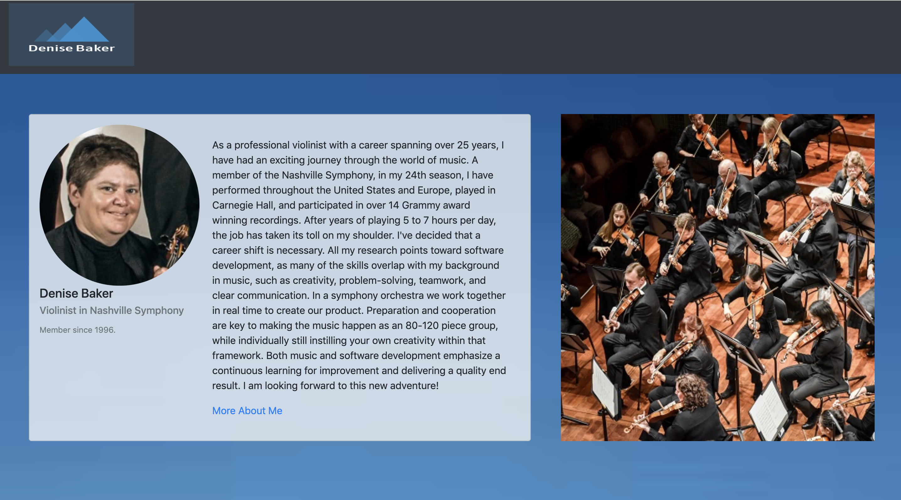
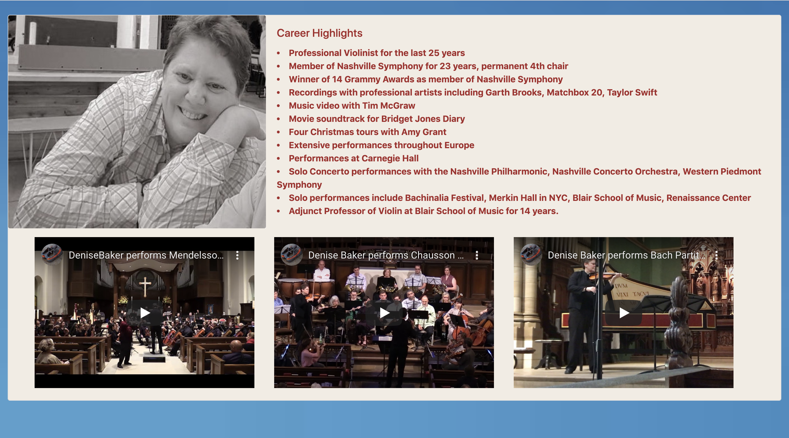
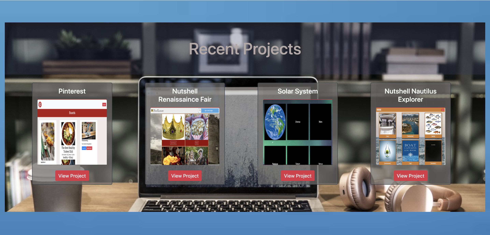
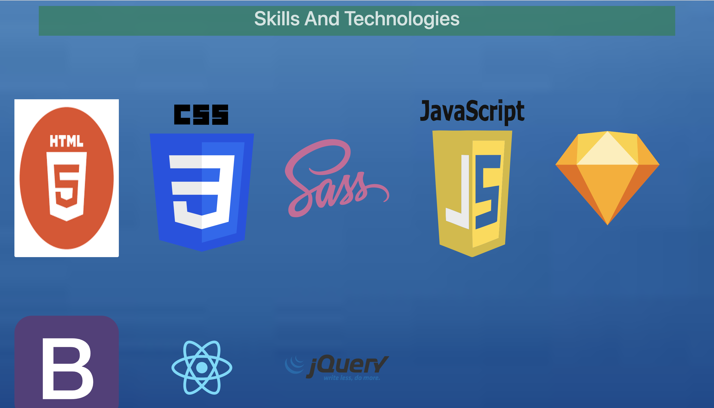

# Personal Bio Site

## Technologies Used
HTML, CSS, Javascript

## Description
Personal Bio Page with sample perfomances, projects, and skills learned.

## Screenshots

## How to run
* Clone down this project
* Install http-server from npm
* At the root of this project run the following command: hs -p 8888
* In your browser navigate to https://localhost: 8888